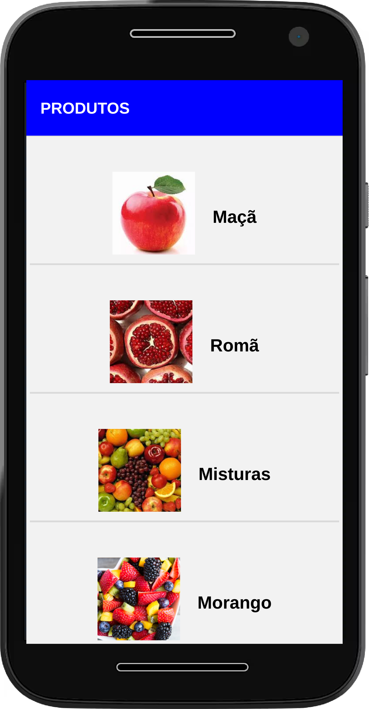

# TEMNOAPP INTERVIWER

   
   

 

 

   Uma aplicação de cadastro de Produto
 

  

 <h1> 

    TECHS
 </h1>
 <ul>
   <li>DDD</li>
   <li>TDD</li>
   <li>Nodejs(express)</li>
   <li>Docker</li>
   <li>Postegres sql</li>
   <li>reactjs</li>
   <li>react native</li>
 </ul>
 

 <h1>
    BEST PRACTISE
 </h1>
 <ul>
   <li>DDD</li>
   <li>TDD</li>
   <li>Clean Code</li>
   <li>POO</li>
 </ul>

 

 <h1>
    INSTALAÇÃO
 </h1>
 

 <h1>
    Backend
 </h1>
 <ul>
   <li>Criar uma imagem docker com a seguintes configuração : 
      <ul>
       <li>porta externa da imagem :5435</li>   
       <li>username:postgres</li>  
       <li>password:mp  ->default</li> 
       <li>database: temnoapp</li> 
      <ul>
   </li>
   <li>executar: yarn ou npm install</li>
   <li>executar: yarn typeorm migration:run</li>
   <li>executar: yarn test</li>
   <li>executar: yarn dev</li>
 </ul>

  

 <h1>
    Frontend
 </h1>
 <ul>
   <li>executar: yarn ou npm install</li>
   <li>executar: yarn start</li>
 </ul>

 

 <h1>
    Mobile
 </h1>
 <ul>
 
   <li>executar: yarn ou npm install</li>
   <li>executar: yarn android</li>
   <li>executar: yarn ios</li>
   <li>executar: yarn web</li>

 </ul>